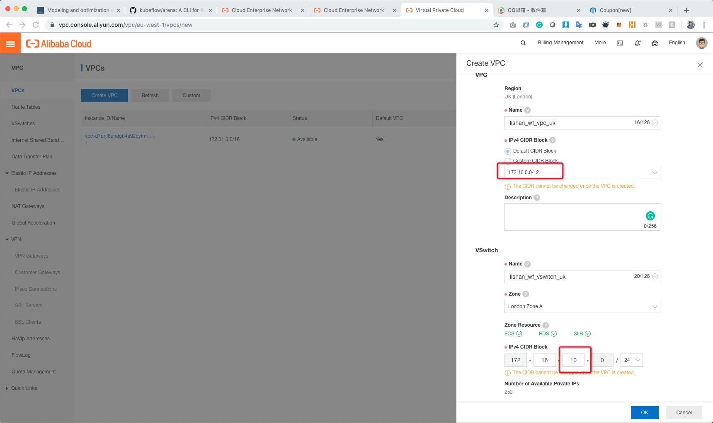

# AlibabaCloud_Demo_CEN-SAG

## Purpose
It demonstrates on how to setup CEN+VPC and then use SAG to connect to Dataworks. 

Content:
1. CEN setup is done
2. SNAT setup is done
3. SAG setup is on the way


## CEN+SAG Configuration Steps:
1. create a VPC in London region

2. create a VPC in Shanghai region

3. create a ECS in London region with London VPC attached (with EIP assigned)

4. create a ECS in Shanghai region with Shanghai VPC attached (with no EIP assigned)

5. create a CEN with one end connecting to London VPC

6. connect CEN the other end to Shanghai VPC

7. buy bandwidth to enable CEN

8. create regions connection between UK and Shanghai

9. setup London VPC to next jump into Dataworks IPV4

10. ssh into London ECS and configure POSTROUTING SNAT. See bellow for ECS SNAT configuration.

11. ssh into Shanghai ECS from London ECS to test if can ping to Dataworks via IPV4


## SAG APP install and configuration
1. download and install SAG app client (https://www.alibabacloud.com/help/doc-detail/102544.htm)

2. configure SAG with (SAG Instance ID, Username, Password)

3. Connect SAG

4. Try to ping ide-eu-west-1.data.aliyun.com and see if it return resolved ip
5. You should be able to visit any UK traffic and will automatically direct to Datawork IP via CEN. 


## SNAT configuration for DataWork next jump in CEN and VPC
```bash
# from a freshly created ECS

# check if ipv4 ip_forwarding is enabled, 1 = enabled
more /proc/sys/net/ipv4/ip_forwarding
echo "1">/proc/sys/net/ipv4/ip_forwarding

# check if ip_forward is enabled, 1 = enabled
vim  /etc/sysctl.conf
net.ipv4.ip_forward = 1

# check if new configure has been effected, if it is enabled, you should see "net.ipv4.ip_forward = 1"
sysctl -p

# check if iptable POSTROUTING is clean, POSTROUTING rules may conflict SNAT.
iptables -t nat -v -L POSTROUTING -n --line-number

# delete incorrect POSTROUTING rule if any conflicts
iptables -t nat --delete POSTROUTING <line number, e.g. 1>

# add correct SNAT
iptables -t nat -I POSTROUTING -s <Dataworks internal IP, e.g. 8.208.18.3> -j SNAT --to-source <your london ECS internal IP, e.g. 172.16.10.44>

# if you have add correct SNAT, you should see bellow 
# $ iptables -t nat -v -L POSTROUTING -n --line-number
# Chain POSTROUTING (policy ACCEPT 0 packets, 0 bytes)
# num   pkts bytes target     prot opt in     out     source               destination
# 1        0     0 SNAT       all  --  *      *       8.208.18.3           0.0.0.0/0            to:172.16.10.44

# ping dataworks IP from Shanghai ECS, you can see IP have been forwarded to London ECS. 
# $ ping ide-eu-west-1.data.aliyun.com
# PING tyjr-eu-west-1.aliyun.com (8.208.18.3) 56(84) bytes of data.
# From 172.16.10.44 (172.16.10.44) icmp_seq=1 Time to live exceeded
# From 172.16.10.44 (172.16.10.44) icmp_seq=2 Time to live exceeded
# From 172.16.10.44 (172.16.10.44) icmp_seq=3 Time to live exceeded
# ...

```